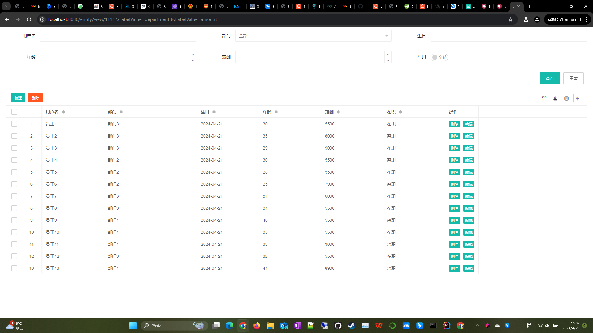

# sql-util 实体SQL工具

[](https://jitpack.io/#com.gitee.wb04307201/sql-util)
[](https://gitee.com/wb04307201/sql-util)
[](https://gitee.com/wb04307201/sql-util)
[](https://github.com/wb04307201/sql-util)
[](https://github.com/wb04307201/sql-util)

> 提供一套高效、便捷的数据库操作工具集，  
> 包括多数据源连接池、SQL语句执行工具类、SQL构造工具以及从实体类构造SQL的工具。  
> 亦可以通过实体快速构造web页面。  
> 帮助开发者简化数据库操作，提高开发效率和代码质量。

## 代码示例
1. 使用[实体SQL工具](https://gitee.com/wb04307201/sql-util)实现的[实体SQL工具Demo](https://gitee.com/wb04307201/sql-util-demo)
2. 使用[文档在线预览](https://gitee.com/wb04307201/file-preview-spring-boot-starter)、[多平台文件存储](https://gitee.com/wb04307201/file-storage-spring-boot-starter)、[实体SQL工具类](https://gitee.com/wb04307201/sql-util)实现的[文件预览Demo](https://gitee.com/wb04307201/file-preview-demo)
3. 使用[多平台文件存储](https://gitee.com/wb04307201/file-storage-spring-boot-starter)、[实体SQL工具类](https://gitee.com/wb04307201/sql-util)实现的[文件存储Demo](https://gitee.com/wb04307201/file-storage-demo)
4. 使用[消息中间件](https://gitee.com/wb04307201/message-spring-boot-starter)、[实体SQL工具类](https://gitee.com/wb04307201/sql-util)实现的[消息发送代码示例](https://gitee.com/wb04307201/message-demo)
5. 使用[动态调度](https://gitee.com/wb04307201/dynamic-schedule-spring-boot-starter)、[消息中间件](https://gitee.com/wb04307201/message-spring-boot-starter)、[动态编译加载执行工具](https://gitee.com/wb04307201/loader-util)、[实体SQL工具](https://gitee.com/wb04307201/sql-util)实现的[在线编码、动态调度、发送钉钉群消息、快速构造web页面Demo](https://gitee.com/wb04307201/dynamic-schedule-demo)

| 序号 | 工具类                 | 描述             |
|----|---------------------|----------------|
| 1  | MutilConnectionPool | 一个多数据源连接池      |
| 2  | ExecuteSqlUtils     | sql语句执行工具类     |
| 3  | SQL                 | SQL构造工具，执行工具   |
| 4  | ModelSqlUtils       | 从实体类构造SQL，执行工具 |
| 5  | EntityWeb       | 从实体类快速构造web页面  |

## 第一步 增加 JitPack 仓库
```xml
<repositories>
    <repository>
        <id>jitpack.io</id>
        <url>https://jitpack.io</url>
    </repository>
</repositories>
```

## 第二步 引入jar
1.3.0版本后升级到jdk 17 SpringBoot 3.2.2
```xml
<dependency>
    <groupId>com.gitee.wb04307201</groupId>
    <artifactId>sql-util</artifactId>
    <version>1.3.0</version>
</dependency>
```

## 第三步 使用工具
#### MutilConnectionPool使用示例
```java
        // 判断数据源是否加载
        if (Boolean.FALSE.equals(MutilConnectionPool.check("test"))) {
            // 加载数据源
            MutilConnectionPool.init("test", "jdbc:h2:file:./data/demo;AUTO_SERVER=TRUE", "sa", "");
        }
        // 获取数据源，注意使用完之后释放连接
        Connection connection = MutilConnectionPool.getConnection("test");
        connection.close();
        // 通过传入函数式接口执行方法，内部会自动创建连接并在使用之后释放
        MutilConnectionPool.run("test", conn -> null);
```

#### ExecuteSqlUtils使用示例
```java
        // 判断数据源是否加载
        if (Boolean.FALSE.equals(MutilConnectionPool.check("test"))) {
        // 加载数据源
        MutilConnectionPool.init("test", "jdbc:h2:file:./data/demo;AUTO_SERVER=TRUE", "sa", "");
        }

        Connection connection = MutilConnectionPool.getConnection("test");

        // 判断表是否存在
        Boolean check = ExecuteSqlUtils.isTableExists(connection, "test_user");
        // 通过MutilConnectionPool.run检查表是否存在
        check = MutilConnectionPool.run("test", conn -> ExecuteSqlUtils.isTableExists(conn, "test_user"));

        Map<Integer, Object> params = new HashMap<>();
        params.put(1, "123123");
        // 执行插入、更新的sql语句
        int count = ExecuteSqlUtils.executeUpdate(connection, "update test_user set user_name = ?", params);
        count = MutilConnectionPool.run("test", conn -> ExecuteSqlUtils.executeUpdate(conn, "update test_user set user_name = ?", params));

        // 执行查询的sql语句
        List<Map<String, Object>> list = ExecuteSqlUtils.executeQuery(connection, "select * from test_user where user_name = ?", params, new TypeReference<Map<String, Object>>() {
        });
        list = MutilConnectionPool.run("test", conn -> ExecuteSqlUtils.executeQuery(conn, "select * from test_user where user_name = ?", params, new TypeReference<Map<String, Object>>() {
        }));

        // 执行删除的sql语句
        MutilConnectionPool.run("test", conn -> ExecuteSqlUtils.executeUpdate(conn, "delete from test_user where user_name = ?", params));

        connection.close();
```

#### 在测试SQL、ModelSqlUtils前，请先创建一个测试实体类，例如
```java
package cn.wubo.sql.util.test;

import cn.wubo.sql.util.annotations.Column;
import cn.wubo.sql.util.annotations.Key;
import cn.wubo.sql.util.annotations.Table;
import cn.wubo.sql.util.enums.ColumnType;
import lombok.Data;

import java.util.Date;

@Data
@Table(value = "test_user", desc = "用户")
public class User {

    @Key
    @Column(value = "id")
    private String id;

    @Column(value = "user_name",desc = "用户名", type = ColumnType.VARCHAR, length = 20)
    private String userName;

    @Column(value = "department")
    private String department;

    @Column(value = "birth", type = ColumnType.DATE)
    private Date birth;

    @Column(value = "birth1")
    private Date birth1;

    @Column(value = "age", type = ColumnType.NUMBER, precision = 10, scale = 0)
    private Integer age;

    @Column(value = "age1")
    private Integer age1;
}
```

#### SQL使用示例
```java
        // 判断数据源是否加载
        if (Boolean.FALSE.equals(MutilConnectionPool.check("test"))) {
            // 加载数据源
            MutilConnectionPool.init("test", "jdbc:h2:file:./data/demo;AUTO_SERVER=TRUE", "sa", "");
        }
        SQL<User> userSQL = new SQL<User>(){};
        // 判断表是否存在
        if(Boolean.TRUE.equals(MutilConnectionPool.run("test",conn -> userSQL.isTableExists(conn)))){
            // 删除表
            MutilConnectionPool.run("test",conn -> userSQL.drop().parse().dropTable(conn));
        }
        // 创建表
        MutilConnectionPool.run("test",conn -> userSQL.create().parse().createTable(conn));
        // 插入数据
        MutilConnectionPool.run("test",conn -> userSQL.insert().addSet("user_name","11111").parse().executeUpdate(conn));
        // 更新数据
        MutilConnectionPool.run("test",conn -> userSQL.update().addSet("user_name","22222").addWhereEQ("user_name","11111").parse().executeUpdate(conn));
        // 查询数据
        List<User> userList = MutilConnectionPool.run("test",conn -> userSQL.select().addWhereEQ("user_name","22222").parse().executeQuery(conn));
        // 删除数据
        MutilConnectionPool.run("test",conn -> userSQL.delete().addWhereEQ("user_name","22222").parse().executeUpdate(conn));
```

#### ModelSqlUtils使用示例
```java
        // 判断数据源是否加载
        if (Boolean.FALSE.equals(MutilConnectionPool.check("test"))) {
            // 加载数据源
            MutilConnectionPool.init("test", "jdbc:h2:file:./data/demo;AUTO_SERVER=TRUE", "sa", "");
        }

        User user = new User();
        // 判断表是否存在
        if (MutilConnectionPool.run("test", conn -> ModelSqlUtils.SQL(user).isTableExists(conn))) {
            // 删除表
            MutilConnectionPool.run("test", conn -> ModelSqlUtils.dropSql(user).dropTable(conn));
        }
        // 创建表
        MutilConnectionPool.run("test", conn -> ModelSqlUtils.createSql(user).createTable(conn));
        // 插入数据
        user.setUserName("112233");
        MutilConnectionPool.run("test", conn -> ModelSqlUtils.insertSql(user).executeUpdate(conn));
        // 查询数据
        List<User> userList = MutilConnectionPool.run("test", conn -> ModelSqlUtils.selectSql(user).executeQuery(conn));
        user.setId(userList.get(0).getId());
        user.setUserName("332211");
        // 更新数据
        MutilConnectionPool.run("test", conn -> ModelSqlUtils.updateSql(user).executeUpdate(conn));
        // 可以使用 ModelSqlUtils.insertSql(user)强行插入数据
        // 可以使用 ModelSqlUtils.updateSql(user)强行更新数据
        // 删除数据
        MutilConnectionPool.run("test", conn -> ModelSqlUtils.deleteSql(user).executeUpdate(conn));
```

#### EntityWeb使用示例
###### 在启动类上加上`@EnableEntityWeb`注解
```java
@EnableEntityWeb
@SpringBootApplication
public class SqlUtilDemoApplication {

    public static void main(String[] args) {
        SpringApplication.run(SqlUtilDemoApplication.class, args);
    }

}
```

###### 按照需求构建实体类
```java
package cn.wubo.sql.util.demo;

import cn.wubo.sql.util.annotations.*;
import cn.wubo.sql.util.enums.ColumnType;
import cn.wubo.sql.util.enums.EditType;
import lombok.Data;

import java.util.Date;

@Data
@Table(value = "test_user", desc = "用户", ds = @Ds(url = "jdbc:h2:file:./data/demo;AUTO_SERVER=TRUE", username = "sa", passowrd = ""))
public class User {

    @Key
    @Column(value = "id")
    private String id;

    @Column(value = "user_name", desc = "用户名", type = ColumnType.VARCHAR, length = 20, edit = @Edit(notNull = true))
    private String userName;

    @Column(value = "department", desc = "部门",
            view = @View(width = 300, translatable = true, items = {@Item(value = "1", label = "部门1"), @Item(value = "2", label = "部门2"), @Item(value = "3", label = "部门3")}),
            edit = @Edit(type = EditType.SELECT, items = {@Item(value = "1", label = "部门1"), @Item(value = "2", label = "部门2"), @Item(value = "3", label = "部门3")}))
    private String department;

    @Column(value = "birth", desc = "生日", type = ColumnType.DATE, edit = @Edit(type = EditType.DATE))
    private Date birth;

    @Column(value = "birth1", view = @View(show = false), edit = @Edit(show = false, search = false))
    private Date birth1;

    @Column(value = "age", desc = "年龄", type = ColumnType.NUMBER, precision = 10, scale = 0, edit = @Edit(type = EditType.NUMBER))
    private Integer age;

    @Column(value = "age1", view = @View(show = false), edit = @Edit(show = false, search = false))
    private Integer age1;
}
```

###### 加载web页面
```java
@Slf4j
@Component
public class InitEntityWeb implements ApplicationRunner {

    @Resource
    EntityWebService entityWebService;

    @Override
    public void run(ApplicationArguments args) throws Exception {
        // 使用给定的id和实体定义加载EntityWeb页面
        entityWebService.build("1111", User.class);
    }

}
```

###### 通过id访问页面
http://ip:port/entity/view/1111
